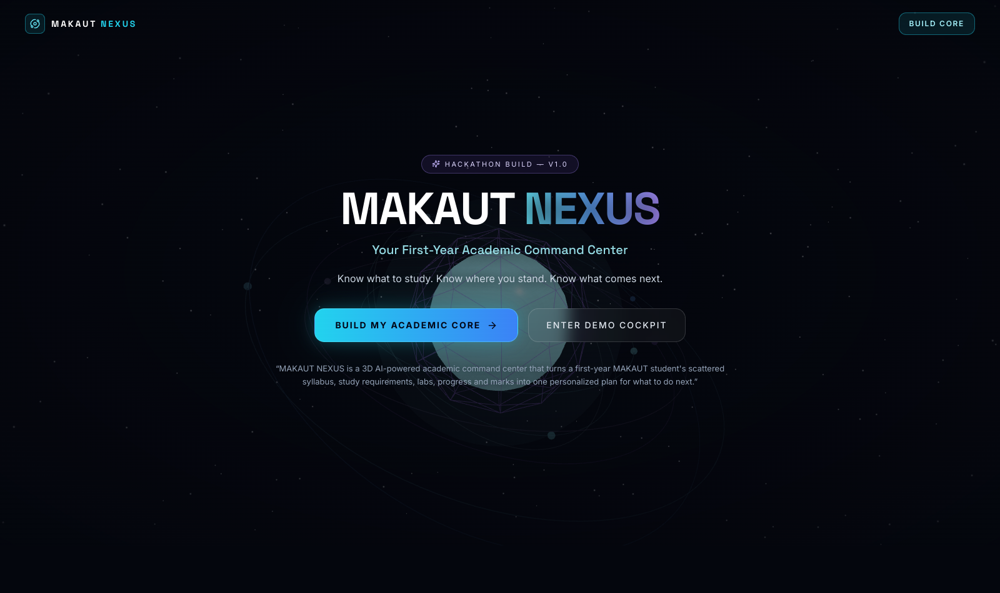
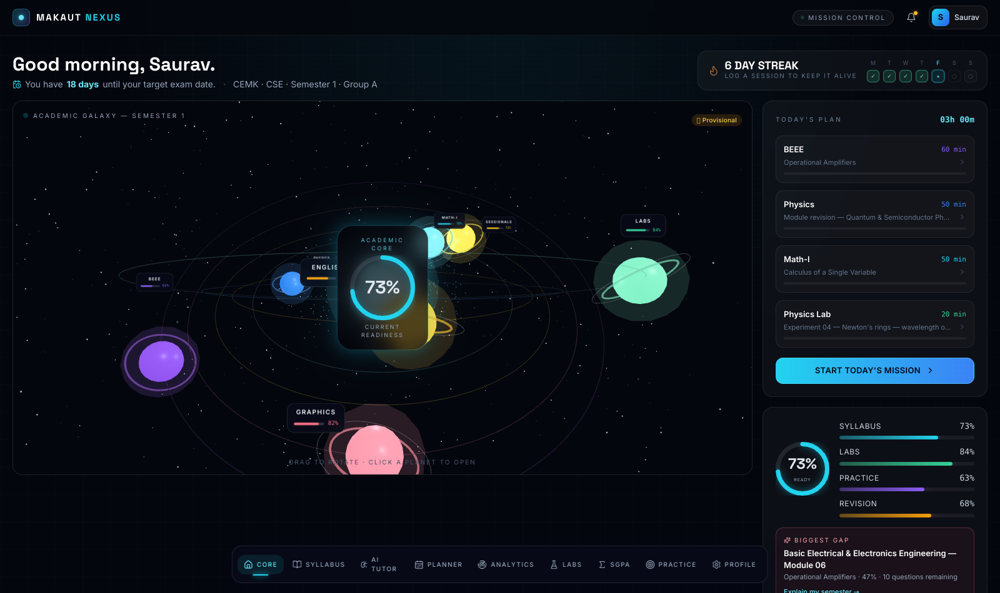
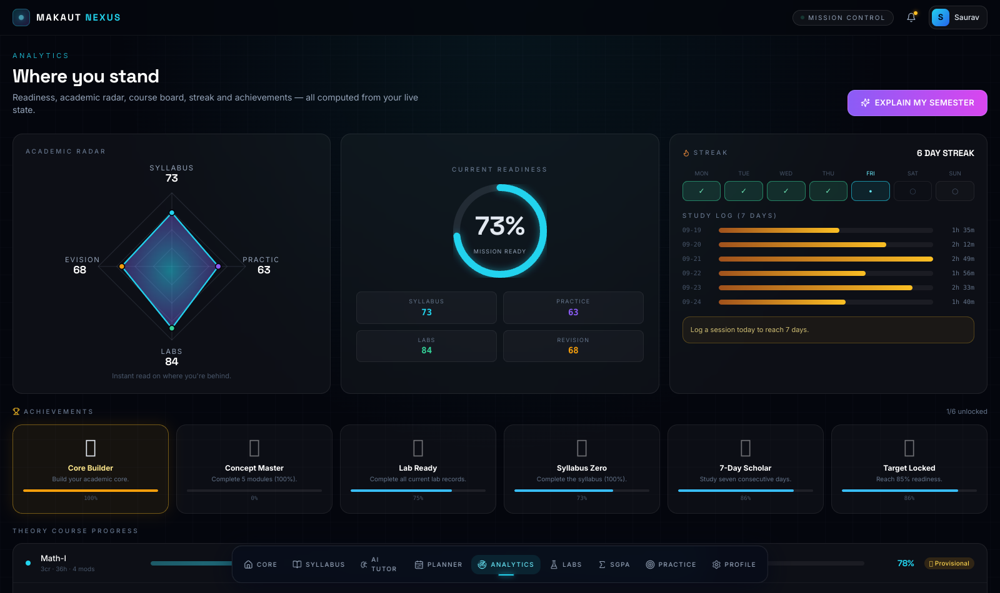

# MAKAUT NEXUS v1.0

**3D AI-powered academic command center for first-year MAKAUT students — syllabus, planner, labs, progress & SGPA in one place.**

> Know what to study. Know where you stand. Know what comes next.

MAKAUT NEXUS turns a first-year student's scattered syllabus, study requirements, labs, progress and marks into one
personalized plan for what to do next — presented as a 3D "academic galaxy" instead of a card dashboard.

## Preview

| Landing | 3D Dashboard | Analytics |
| --- | --- | --- |
|  |  |  |

---

## Run it

```bash
npm install
npm run dev        # http://localhost:5173
```

Other scripts:

```bash
npm run typecheck  # tsc --noEmit
npm run build      # production build → dist/
node scripts/run-check.mjs   # engine self-check (readiness, mission, gap, SGPA, plan, chat intents, streak)
```

## Deployment (GitHub Pages)

Every push to the build branch runs `.github/workflows/deploy.yml`
(typecheck → engine self-check → build → deploy). One-time repo-owner setup:

1. Open **Settings → Pages → Build and deployment**
2. Set **Source** to **GitHub Actions**

After that the site publishes automatically at
`https://authorsauravkushwaha.github.io/MAKAUT-NEXUS-v1.0/` (the build uses a
relative `base`, so it works under any sub-path).

## The experience

| Screen | Route | What it does |
| --- | --- | --- |
| Landing | `/` | Pitch, 3D hero core, system columns (Academics / AI Engine / Analytics) |
| Onboarding | `/onboarding` | Build profile → "BUILD MY ACADEMIC CORE" generation sequence |
| **3D Dashboard** | `/dashboard` | Academic Core (readiness %) + orbiting subject planets, today's plan, streak |
| Syllabus Explorer | `/syllabus` | Semester 1 · 20 credits\* · 10 components · every fact has ⓘ Source |
| Subject Detail | `/syllabus/:id` | 3D objective field, module board, concept checklists, questions, outcomes |
| NEXUS AI | `/ai` | State-grounded chat: 📘 academic vs 🏫 structured MAKAUT data |
| Study Planner | `/planner` | Foundation → Coverage → Revision+Practice plan with daily tasks |
| Analytics | `/analytics` | Academic radar, readiness, streak, achievements, **Explain My Semester** |
| Lab Command Center | `/labs` | Experiments · records · teacher verification gates |
| Sessionial Tracker | `/sessionals` | NCC/NSS/Yoga/Sports + MOOC (non-theory requirements) |
| SGPA Center | `/sgpa` | Provisional-grade projection + what-if simulator |
| Practice Arena | `/practice` | Tagged question bank + exam mode with timer & explanations |
| Profile | `/profile` | Mission parameters, knowledge sources, data policy, reset |

## The AI is a real engine (no canned answers)

- **Today's Mission** — allocates the daily budget from exam date, module hours, current completion, practice deficit,
  revision state and pending lab records (cap 60 min/subject, 20 min lab slot).
- **Study planner** — deterministic phase split (40 / 35 / 25) with per-day tasks from remaining hours.
- **Biggest gap** — weighted module lag behind its course average × hours × credits × Bloom level × practice deficit.
- **SGPA** — credit-weighted grade points through a clearly-labelled 🟡 **provisional** rule table
  (official regulation SRC-003 still pending — uncertain rules are never hard-coded as final).
- **Chat intents** — mission, semester explanation, concept tutoring (e.g. Kirchhoff's → grounded in BEEE Module 2),
  SGPA projection, lab audit, progress — all computed from live student state.

## Data provenance rule

Every academic fact in `/data` carries:

```json
{
  "source_ref": "SRC-001",
  "source_type": "secondary",
  "verification_status": "provisional",
  "checked": "2026-09-25"
}
```

Unresolved 2026 structure conflicts (CONF-01…03) are surfaced in the UI as **verification pending** instead of being
presented as official. The prototype is fully ready for the verified dataset — drop it into `/data` and the app
re-reads it.

## Stack

Vite · React 18 · TypeScript · Tailwind CSS · React Three Fiber + drei (3D) · Framer Motion · lucide-react ·
bundled Inter + Space Grotesk fonts · localStorage persistence (no server, no account).

## Demo state

Ships seeded as the demo pilot **Saurav @ CEMK**: readiness 73%, Math-I 78% / BEEE 61% / Physics 45% / Labs 84%,
exam in 18 days, 6-day streak, biggest gap = BEEE Module 6 (Op-Amps). *Profile → Restore demo pilot* re-seeds;
*Reset & rebuild core* runs the onboarding flow with a blank state.

---

_Not affiliated with MAKAUT or CEMK. Prototype academic data is marked provisional where sources conflict._
